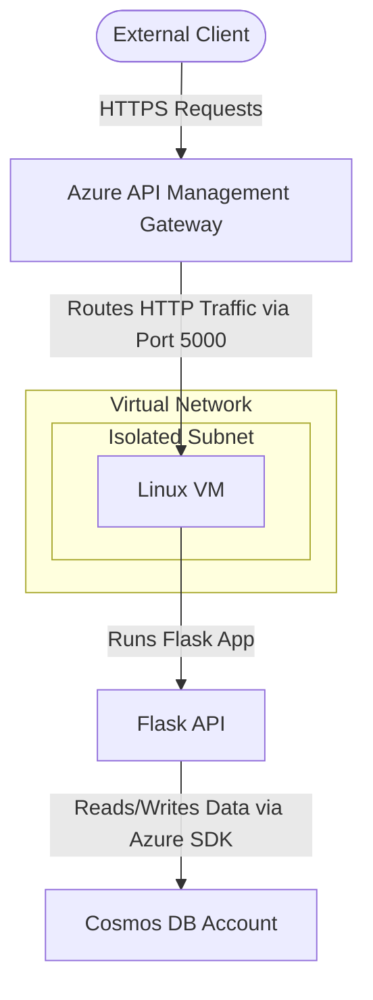

# Secure Azure Multi-Tier Infrastructure with APIM, VM & Cosmos DB

An enterprise-grade, modular Terraform architecture on Azure. This project provisions a highly secure API Management (APIM) gateway routing traffic to a Python Flask API running inside an isolated Linux Virtual Machine, backed by an Azure Cosmos DB (NoSQL) database.

---

## 1. System Architecture

The following diagram illustrates the secure request flow and resource grouping:



---

## 2. Project Directory Structure

```text
├── app/
│   ├── app.py                # Python Flask application source code
│   └── requirements.txt      # Python library dependencies
├── environments/
│   └── dev/                  # Development environment configuration
│       ├── main.tf           # Resource module integration
│       ├── outputs.tf        # Combined environment-level outputs
│       ├── terraform.tfvars  # Deployment variable values
│       ├── variables.tf      # Root-level variable definitions
│       └── provider.tf       # AzureRM provider configuration
├── modules/
│   ├── resource-group/       # Resource group module
│   ├── network/              # Virtual network, subnet & NSG module
│   ├── vm/                   # Linux Virtual Machine module (SSH authenticated)
│   ├── apim/                 # API Management setup (API, operations, and rate-limiting)
│   └── cosmosdb/             # Serverless Cosmos DB SQL account, database, and container
└── scripts/
    └── install_api.sh        # Automation script to prepare the Flask VM environment
```

---

## 3. Design Decisions & Highlights

* **APIM Developer SKU (`Developer_1`)**: Selected for cost-effective development and review. It supports all advanced Premium features—including VNet integration and custom policies—without the high enterprise licensing costs.
* **Cosmos DB Serverless**: Enabled serverless capacity mode. This avoids fixed hourly provisioned throughput charges, charging only for the Request Units (RUs) consumed during active queries.
* **API Rate Limiting Policy**: Configured an inbound policy directly inside the APIM gateway restricting clients to **10 calls per 60 seconds**. This protects the compute layer from DDoS attacks and API abuse.
* **Network Isolation**: The Flask VM is hidden inside an isolated VNet subnet, with inbound port access controlled tightly by Network Security Groups (NSGs). Traffic must route through the APIM reverse proxy.

---

## 4. Getting Started & Deployment Guide

### Step 1: Deploy Azure Infrastructure
Navigate to the dev environment and initialize Terraform:
```bash
cd environments/dev
terraform init
terraform apply -auto-approve
```

### Step 2: Extract Outputs
Once the apply is complete, retrieve the VM public IP and Cosmos DB credentials:
```bash
# Get VM Public IP
terraform output vm_public_ip

# Get Cosmos DB Endpoint
terraform output cosmosdb_endpoint

# Get Cosmos DB Key
terraform output -raw cosmosdb_primary_key
```

### Step 3: Deploy and Run the Flask App on the VM
1. SSH into your newly created VM:
   ```bash
   ssh aslah@<VM_PUBLIC_IP>
   ```
2. Place the code from the `app/` folder into your VM directory (e.g. `app.py` and `requirements.txt`).
3. Set the Cosmos DB environment variables on the VM:
   ```bash
   export COSMOS_ENDPOINT="<COSMOS_DB_ENDPOINT>"
   export COSMOS_KEY="<COSMOS_DB_PRIMARY_KEY>"
   ```
4. Run the setup script to install dependencies:
   ```bash
   ./scripts/install_api.sh
   ```
5. Start the application:
   ```bash
   python3 app.py
   ```

---

## 5. Verification & Testing

Verify the end-to-end integration by running these tests from your local machine:

### A. Health Endpoint
```bash
curl -i https://apim-dev-aslah.azure-api.net/flask/health
```
* **Expected Result**: `200 OK` with JSON `{"status":"running","cosmos_connected":true}`.

### B. Create a User (POST)
```bash
curl -i -X POST -H "Content-Type: application/json" \
  -d '{"name": "Aslah", "email": "aslahea68@gmail.com"}' \
  https://apim-dev-aslah.azure-api.net/flask/users
```
* **Expected Result**: `201 Created` returning the created user containing a unique UUID.

### C. List Users (GET)
```bash
curl -i https://apim-dev-aslah.azure-api.net/flask/users
```
* **Expected Result**: `200 OK` returning the array of users retrieved directly from Cosmos DB.

### D. Verify Rate Limiting
Run the health curl command 11 times within 60 seconds. On the 11th call, you should receive:
```http
HTTP/1.1 429 Too Many Requests
```

---

## 6. Cleanup
To delete all resources when finished:
```bash
cd environments/dev
terraform destroy -auto-approve
```
